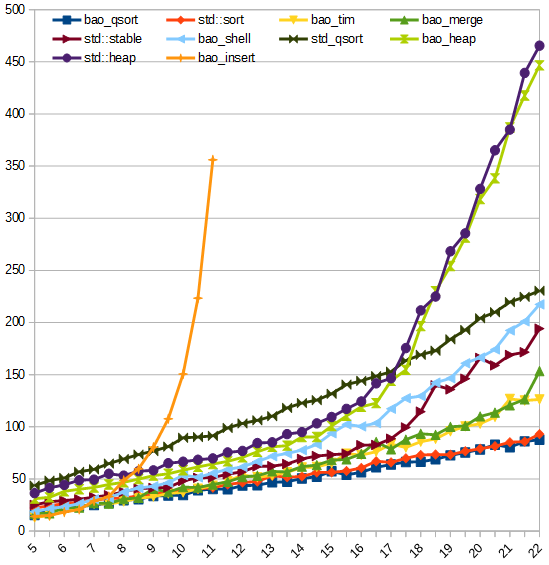
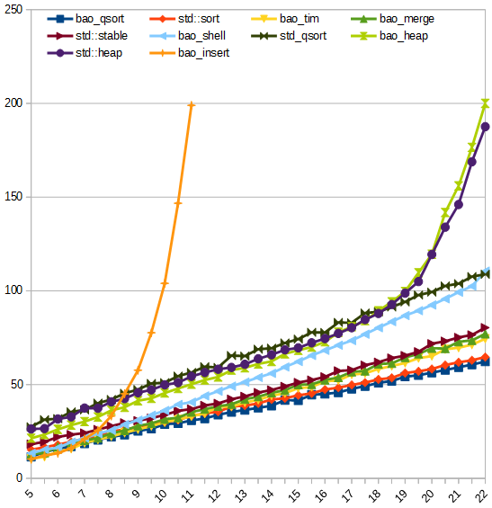

# Sort

[](https://travis-ci.org/Baobaobear/sort) [](https://ci.appveyor.com/project/Baobaobear/sort) [](https://isocpp.org/) [](https://en.wikipedia.org/wiki/C%2B%2B#Standardization) [](https://opensource.org/licenses/MIT)

# Overview

This is a sorting library, compatible with C++03

## Algorithm table

Algorithm     | Stable|Best|  Average  |   Worst   | Mem | Header | Name |
-------------------|---|---|-----------|-----------|-----|--------| -----|
Insertion sort     |yes| n | n^2       | n^2       | 1   | sortlib.hpp | insert_sort |
Heapsort           |no | n | nlogn     | nlogn     | 1   | sortlib.hpp | heap_sort |
Shellsort          |no | n | n^(4/3) ? | n^(4/3) ? | 1   | sortlib.hpp | shell_sort |
Quicksort          |no | n | nlogn     | nlogn     | logn| sortlib.hpp | quick_sort |
Quicksort indirect |yes| n | nlogn     | nlogn     | logn| sortlib.hpp | indirect_qsort |
Mergesort          |yes| n | nlogn     | nlogn     | n   | sortlib.hpp | merge_sort |
Mergesort buffer   |yes| n | n(logn)^2 | n(logn)^2 | logn| sortlib.hpp | merge_sort_buffer |
Mergesort in-place |yes| n | n(logn)^2 | n(logn)^2 | logn| sortlib.hpp | merge_sort_in_place |
Timsort            |yes| n | nlogn     | nlogn     | n   | sortlib.hpp | tim_sort |
Grailsort dynamic  |yes| n | nlogn     | nlogn | sqrt(n) | grailsort.hpp | grail_sort |
Grailsort buffer   |yes| n | nlogn     | nlogn | 1       | grailsort.hpp | grail_sort_buffer |
Grailsort in-place |yes| n | nlogn     | nlogn | 1       | grailsort.hpp |grail_sort_in_place|
Wikisort           |yes| n | nlogn     | nlogn     | 1   | wikisort.hpp | wiki_sort |

# Usage

Here is the demo, or you can try [demo.cpp](demo.cpp)

```c
#include "sortlib.hpp"
#include <cstdlib>

int main(void)
{
    std::vector<int> arr(100);

    for (size_t i = 0; i < arr.size(); i++)
    {
        arr[i] = rand();
    }

    baobao::sort::tim_sort(arr.begin(), arr.end());
    return 0;
}
```

Call it like STL as well

Note:  
`merge_sort_s`, `merge_sort_buffer_s`, `tim_sort_s` is the safe copy version if you overload operator `=` and do something different

# Performance

Run the code [sorttest.cpp](sorttest.cpp), it will output the result

Build with `g++ -std=c++03 -O3 sorttest.cpp` on Centos 7 x64, gcc version is 8.3.1

Functions name with `bao_` perfix are in `sortlib.hpp` header  
Functions name with `grail_` perfix are in `grailsort.hpp` header  
`std_qsort` is the `qsort` function in `stdlib.h` header

#### Sorting 2,000,000 TestClass

TestClass 8 |  1  |  2  |  3  |  4  |  5  |  6  |  7  |  8  |  9  |  10 |  11 | Avg |
------------|----:|----:|----:|----:|----:|----:|----:|----:|----:|----:|----:|----:|
bao_qsort   |   10|   22|   29|  154|  154|   55|   51|   62|   84|  148|  117|   80|
std::sort   |  100|   59|   58|  192|  167|  117|  118|   69|   92|  160|  129|  114|
bao_tim     |    5|    8|   18|  236|  225|  206|  151|    9|   87|  217|  114|  116|
bao_merge   |    5|   15|  150|  226|  220|  188|  152|   52|   79|  226|  127|  130|
bao_mer_buf |    4|   14|  127|  354|  352|  240|  171|   51|   79|  326|  125|  167|
bao_shell   |    9|   14|  118|  373|  381|  190|  145|   83|  106|  352|  136|  173|
wiki_sort   |   13|   62|  210|  340|  358|  332|  251|  129|  177|  334|  145|  213|
bao_mer_in  |    5|   14|  126|  510|  526|  266|  204|   50|   87|  493|  163|  222|
std::stable |  277|  272|  279|  313|  320|  289|  293|  271|  274|  320|  146|  277|
std_qsort   |  165|  175|  266|  421|  413|  353|  302|  201|  223|  415|  260|  290|
grail_dyn   |   76|  279|  324|  445|  432|  424|  318|  287|  286|  422|  215|  318|
bao_heap    |   28|  165|  196|  725|  708|  266|  265|  177|  189|  716|  172|  327|
bao_indir   |   75|   56|   55|  733|  734|  531|  558|  124|  143|  665|  153|  347|
std::heap   |  189|  190|  230|  795|  760|  318|  299|  192|  208|  757|  217|  377|

#### Sorting 4,500,000 int

int         |  1  |  2  |  3  |  4  |  5  |  6  |  7  |  8  |  9  |  10 |  11 | Avg |
------------|----:|----:|----:|----:|----:|----:|----:|----:|----:|----:|----:|----:|
bao_qsort   |    4|   11|   26|  267|  269|   65|   44|   70|  106|  256|  190|  118|
bao_tim     |    2|    3|    6|  315|  312|  139|   61|    7|   99|  315|  204|  133|
std::sort   |   42|   53|   59|  280|  281|  104|   87|   69|  136|  271|  211|  144|
bao_merge   |    3|   17|   64|  339|  322|  143|   92|   61|  105|  316|  217|  152|
bao_shell   |    4|    5|   57|  404|  400|  179|   51|   33|   84|  379|  216|  164|
bao_mer_buf |    5|   16|   82|  356|  361|  157|  136|   58|  103|  350|  215|  167|
std::stable |   79|   80|   90|  351|  344|  184|   84|   88|  143|  340|  241|  184|
wiki_sort   |   14|   39|   85|  415|  405|  229|  141|   87|  152|  395|  246|  200|
grail_dyn   |   61|  106|  129|  416|  427|  383|  161|  117|  174|  392|  389|  250|
std_qsort   |  126|  131|  161|  488|  495|  312|  208|  157|  221|  477|  380|  286|
bao_mer_in  |    3|   16|   99|  778|  795|  279|  232|   72|  126|  728|  324|  313|
bao_heap    |   12|  223|  235|  789|  771|  270|  246|  214|  243|  783|  299|  371|
std::heap   |  228|  213|  230|  818|  834|  297|  251|  204|  244|  819|  350|  408|
bao_indir   |  126|   77|   89| 1389| 1413| 1077| 1107|  175|  274| 1268|  333|  666|

# Benchmark of random shuffle data 

The x-axis is `log2(length)`

The y-axis is `time / length * 1000000`

#### Sorting TestClass

[](img/benchmark_class8.png)

#### Sorting int

[](img/benchmark_int.png)


# License

This project is licensed under the MIT License.

