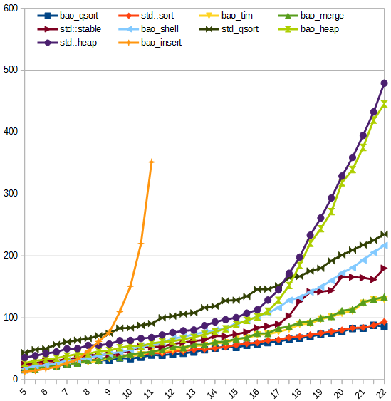

# Sort

[](https://travis-ci.org/Baobaobear/sort) [](https://ci.appveyor.com/project/Baobaobear/sort) [](https://isocpp.org/) [](https://en.wikipedia.org/wiki/C%2B%2B#Standardization) [](https://opensource.org/licenses/MIT)

# Overview

This is a sorting library, compatible with C++03

## Algorithm table

Algorithm     | Stable | Best  |  Average  |   Worst   | Mem | Header | Name |
-------------------|---|-------|-----------|-----------|-----|--------| -----|
Insertion sort     |yes| n     | n^2       | n^2       | 1   | sortlib.hpp | insert_sort |
Heapsort           |no | n     | nlogn     | nlogn     | 1   | sortlib.hpp | heap_sort |
Shellsort          |no | nlogn | n^(4/3) ? | n^(4/3) ? | 1   | sortlib.hpp | shell_sort |
Quicksort          |no | n     | nlogn     | nlogn     | logn| sortlib.hpp | quick_sort |
Quicksort indirect |yes| n     | nlogn     | nlogn     | logn| sortlib.hpp | indirect_qsort |
Mergesort          |yes| n     | nlogn     | nlogn     | n   | sortlib.hpp | merge_sort |
Mergesort buffer   |yes| n     | n(logn)^2 | n(logn)^2 | logn| sortlib.hpp | merge_sort_buffer |
Mergesort in-place |yes| n     | n(logn)^2 | n(logn)^2 | logn| sortlib.hpp | merge_sort_in_place |
Timsort            |yes| n     | nlogn     | nlogn     | n   | sortlib.hpp | tim_sort |
Grailsort dynamic  |yes| n     | nlogn     | nlogn | sqrt(n) | grailsort.hpp | grail_sort |
Grailsort buffer   |yes| n     | nlogn     | nlogn | 1       | grailsort.hpp | grail_sort_buffer |
Grailsort in-place |yes| n     | nlogn     | nlogn | 1       | grailsort.hpp | grail_sort_in_place |
Wikisort           |yes| n     | nlogn     | nlogn     | 1   | wikisort.hpp | wiki_sort |

# Usage

Here is the demo, or you can try [demo.cpp](demo.cpp)

```c
#include "sortlib.hpp"
#include <cstdlib>

int main(void)
{
    std::vector<int> arr(100);

    for (size_t i = 0; i < arr.size(); i++)
    {
        arr[i] = rand();
    }

    baobao::sort::tim_sort(arr.begin(), arr.end());
    return 0;
}
```

Call it like STL as well

Note:  
`merge_sort_s`, `merge_sort_buffer_s`, `tim_sort_s` is the safe copy version if you overload operator `=` and do something different

# Performance

Run the code [sorttest.cpp](sorttest.cpp), it will output the result

Build with `g++ -std=c++03 -O3 sorttest.cpp` on Centos 7 x64, gcc version is 8.3.1

Functions name with `bao_` perfix are in `sortlib.hpp` header  
Functions name with `grail_` perfix are in `grailsort.hpp` header  
`std_qsort` is the `qsort` function in `stdlib.h` header

#### Sorting 2,000,000 TestClass

TestClass 8 |  1  |  2  |  3  |  4  |  5  |  6  |  7  |  8  |  9  |  10 |  11 |  12 | Avg |
------------|----:|----:|----:|----:|----:|----:|----:|----:|----:|----:|----:|----:|----:|
bao_qsort   |   10|   19|   49|  153|  160|   55|   52|   73|   70|   89|  144|  108|   81|
bao_tim     |    5|    8|   14|  216|  217|  182|  138|    9|  118|   76|  238|  111|  111|
std::sort   |   99|   54|   59|  164|  178|  112|  117|   65|  149|   84|  155|  124|  113|
bao_merge   |    5|   15|  168|  217|  229|  180|  148|   61|  132|   74|  213|  120|  130|
bao_mer_buf |    5|   14|  120|  340|  360|  204|  163|   51|  192|   76|  312|  133|  164|
bao_shell   |  103|  106|  121|  391|  350|  217|  151|  105|  181|  148|  329|  152|  196|
wiki_sort   |   12|   60|  200|  357|  346|  301|  249|  125|  227|  169|  312|  143|  208|
bao_mer_in  |    6|   14|  116|  534|  499|  242|  197|   50|  218|   83|  478|  162|  216|
std::stable |  277|  254|  262|  313|  288|  285|  255|  252|  272|  284|  290|  165|  266|
std_qsort   |  159|  208|  256|  403|  403|  350|  286|  212|  287|  215|  419|  258|  288|
grail_dyn   |   74|  274|  307|  413|  431|  398|  293|  278|  418|  267|  394|  211|  313|
bao_heap    |   28|  164|  178|  673|  665|  251|  249|  164|  420|  178|  687|  169|  318|
bao_indir   |   43|   45|   77|  722|  730|  543|  571|  117|  570|  145|  650|  162|  364|
std::heap   |  189|  179|  237|  714|  710|  309|  300|  183|  478|  199|  720|  212|  369|

#### Sorting 4,500,000 int

int         |  1  |  2  |  3  |  4  |  5  |  6  |  7  |  8  |  9  |  10 |  11 |  12 | Avg |
------------|----:|----:|----:|----:|----:|----:|----:|----:|----:|----:|----:|----:|----:|
bao_qsort   |    4|   10|   26|  276|  268|   67|   50|   69|   70|  108|  257|  188|  116|
bao_tim     |    2|    3|    5|  342|  317|  136|   63|    5|   42|  100|  301|  197|  126|
std::sort   |   42|   55|   57|  281|  277|  105|   87|   68|  120|  116|  271|  211|  140|
bao_merge   |    4|   18|   79|  341|  333|  149|   90|   63|   52|  106|  309|  213|  146|
bao_mer_buf |    3|   16|   82|  354|  375|  153|  123|   55|   80|  101|  332|  224|  158|
std::stable |   76|   75|   78|  341|  346|  182|   98|   88|   93|  137|  333|  239|  173|
bao_shell   |   53|   46|   67|  497|  469|  183|   74|   51|  145|  106|  453|  238|  198|
wiki_sort   |   13|   39|   82|  405|  438|  243|  150|   80|  143|  150|  406|  256|  200|
grail_dyn   |   55|  102|  128|  430|  420|  372|  159|   98|  346|  163|  388|  383|  253|
std_qsort   |  123|  131|  156|  500|  482|  312|  209|  156|  181|  220|  471|  376|  276|
bao_mer_in  |    3|   16|   97|  799|  750|  279|  223|   55|  170|  122|  742|  310|  297|
bao_heap    |    8|  194|  216|  763|  761|  243|  226|  195|  412|  231|  755|  289|  357|
std::heap   |  232|  222|  228|  809|  803|  294|  246|  228|  468|  249|  815|  350|  412|
bao_indir   |   62|   78|  111| 1387| 1387| 1142| 1134|  204| 1106|  277| 1254|  319|  705|

# Benchmark of random shuffle data 

The x-axis is `log2(length)`

The y-axis is `time / length * 1000000`

#### Sorting TestClass

[](img/benchmark_class8.png)

#### Sorting int

[](img/benchmark_int.png)


# License

This project is licensed under the MIT License.

