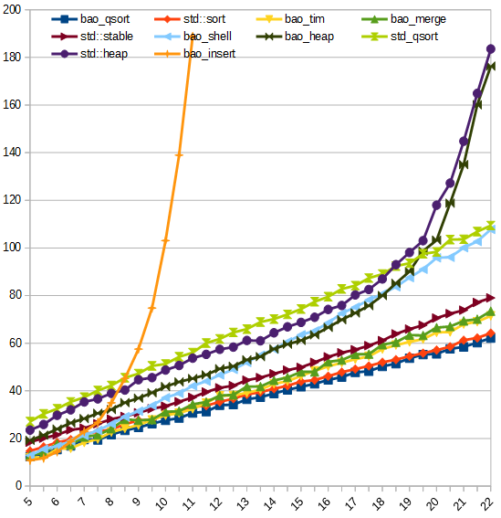

# Sort

[![Build Status]][Travis CI][![Appveyor status]][Appveyor] [![Language]](https://isocpp.org/)[![Standard]][Standard Cpp][![License]][MIT]

# Overview

This is a highly-optimized sorting library, compatible with C++03

## Algorithm table

Algorithm     | Stable|Best| Average | Worst | Mem | Header | Name |
-------------------|---|---|---------|-------|-----|--------|------|
Insertion sort     |yes| n | n²      | n²    | 1   | sortlib.hpp | insert_sort         |
Heapsort           |no | n | n㏒n    | n㏒n  | 1   | sortlib.hpp | heap_sort           |
Shellsort |no | n | n<sup>5/4</sup> ? | n<sup>4/3</sup> | 1 | sortlib.hpp | shell_sort |
Quicksort          |no | n | n㏒n    | n㏒n  | ㏒n | sortlib.hpp | quick_sort          |
Quicksort indirect |yes| n | n㏒n    | n㏒n  | n   | sortlib.hpp | indirect_qsort      |
Mergesort          |yes| n | n㏒n    | n㏒n  | n   | sortlib.hpp | merge_sort          |
Mergesort buffer   |yes| n | n㏒²n   | n㏒²n | √n  | sortlib.hpp | merge_sort_buffer   |
Mergesort in-place |yes| n | n㏒²n   | n㏒²n | ㏒n | sortlib.hpp |merge_sort_in_place  |
Timsort            |yes| n | n㏒n    | n㏒n  | n   | sortlib.hpp | tim_sort            |
Timsort buffer     |yes| n | n㏒n    | n㏒n  | √n  | sortlib.hpp | tim_sort_buffer     |
Radixsort in-place |no | n | n       | n     | 1   | sortlib.hpp | radix_sort_in_place |
[Grailsort]        |yes| n | n㏒n    | n㏒n  | √n  | grailsort.hpp | grail_sort        |
Grailsort buffer   |yes| n | n㏒n    | n㏒n  | 1   | grailsort.hpp | grail_sort_buffer |
Grailsort in-place |yes| n | n㏒n    | n㏒n  | 1   | grailsort.hpp |grail_sort_in_place|
[Wikisort]         |yes| n | n㏒n    | n㏒n  | 1   | wikisort.hpp  | wiki_sort         |

Timsort: Tim Peter's [original implementation](https://github.com/python/cpython/blob/master/Objects/listsort.txt)

# Usage

Here is the demo, or you can try [demo.cpp]

```c
#include "sortlib.hpp"
#include <cstdlib>

int main(void)
{
    std::vector<int> arr(100);

    for (size_t i = 0; i < arr.size(); i++)
    {
        arr[i] = rand();
    }

    baobao::sort::tim_sort(arr.begin(), arr.end());
    return 0;
}
```

Call it like STL as well

### Note
`merge_sort_s`, `merge_sort_buffer_s`, `tim_sort_s` is the safe copy version if you overload operator `=` and do something different

# Performance

Run the code [sorttest.cpp], it will output the result

Build with `g++ -std=c++03 -O3 sorttest.cpp` on Centos 7 x64, gcc version is 8.3.1

Functions name with `bao_` perfix are in `sortlib.hpp` header  
Functions name with `grail_` perfix are in `grailsort.hpp` header  
`std_qsort` is the `qsort` function in `stdlib.h` header

#### Sorting 2,000,000 TestClass

TestClass 8 |  1  |  2  |  3  |  4  |  5  |  6  |  7  |  8  |  9  |  10 |  11 | Avg |
------------|----:|----:|----:|----:|----:|----:|----:|----:|----:|----:|----:|----:|
bao_qsort   |   10|   24|   32|  163|  160|   59|   61|   80|   98|  161|  123|   88|
bao_radix_in|   40|   63|   76|  121|  145|   75|   83|   66|   74|  135|   99|   88|
std::sort   |  121|   61|   65|  173|  184|  141|  129|   84|  106|  166|  143|  124|
bao_tim     |    6|    9|   19|  272|  244|  225|  158|   11|   94|  245|  155|  130|
bao_merge   |    6|   18|  184|  255|  247|  212|  177|   75|   74|  253|  128|  148|
bao_tim_buf |    6|    9|   17|  372|  358|  243|  193|   11|   88|  316|  125|  158|
bao_mer_buf |    5|   21|  135|  326|  371|  256|  198|   66|   96|  335|  148|  177|
bao_shell   |    9|   13|  132|  425|  431|  226|  172|  100|  112|  412|  155|  198|
wiki_sort   |   17|   67|  237|  399|  418|  350|  296|  155|  204|  363|  170|  243|
bao_mer_in  |    6|   17|  137|  573|  603|  308|  248|   64|  103|  524|  186|  251|
std::stable |  305|  332|  330|  338|  338|  342|  309|  286|  304|  355|  155|  308|
std_qsort   |  206|  205|  295|  546|  526|  413|  344|  248|  270|  464|  306|  347|
grail_sort  |   92|  301|  347|  503|  499|  492|  325|  327|  300|  451|  291|  357|
bao_heap    |   32|  221|  212|  845|  792|  319|  303|  197|  203|  833|  217|  379|
bao_indir   |  102|   74|   59|  754|  838|  618|  640|  113|  161|  745|  171|  388|
std::heap   |  219|  253|  294|  852|  840|  353|  326|  197|  245|  899|  235|  428|

#### Sorting 4,500,000 int

int         |  1  |  2  |  3  |  4  |  5  |  6  |  7  |  8  |  9  |  10 |  11 | Avg |
------------|----:|----:|----:|----:|----:|----:|----:|----:|----:|----:|----:|----:|
bao_radix_in|   41|  110|  105|  164|  228|   79|   73|  117|  118|  163|  165|  123|
bao_qsort   |    4|   11|   24|  303|  292|   71|   41|   76|  110|  290|  217|  130|
bao_tim     |    2|    2|    9|  362|  353|  156|   80|    6|  114|  339|  222|  149|
bao_tim_buf |    2|    3|    8|  399|  387|  155|   84|    9|  116|  376|  218|  159|
std::sort   |   62|   65|   66|  304|  315|  121|  109|   75|  137|  305|  230|  162|
bao_merge   |    4|   20|   84|  378|  352|  183|  105|   63|  115|  345|  246|  172|
bao_mer_buf |    6|   15|   65|  406|  381|  188|  112|   70|  117|  376|  254|  180|
bao_shell   |    4|    5|   71|  483|  451|  178|   61|   40|   95|  427|  233|  186|
std::stable |  105|   99|   99|  374|  366|  175|   95|  104|  164|  361|  254|  199|
wiki_sort   |   16|   41|   89|  466|  449|  264|  146|   89|  162|  440|  260|  220|
grail_sort  |   61|  116|  141|  445|  475|  438|  195|  125|  177|  435|  445|  277|
std_qsort   |  143|  154|  181|  536|  555|  345|  235|  171|  261|  542|  419|  322|
bao_mer_in  |    3|   15|  129|  944|  942|  329|  283|   67|  150|  912|  367|  376|
bao_heap    |    9|  242|  272|  883|  956|  297|  308|  236|  260|  892|  328|  425|
std::heap   |  235|  255|  272|  969|  969|  310|  311|  249|  309|  950|  383|  473|
bao_indir   |  123|   86|  109| 1561| 1556| 1219| 1261|  219|  290| 1398|  357|  743|

# Benchmark of random shuffle data 

The x-axis is `log2(length)`

The y-axis is `time / length * 1000000`

#### Sorting TestClass

[](img/benchmark_class8.png)

#### Sorting int

[](img/benchmark_int.png)


# License

This project is licensed under the MIT License.

[Build Status]:     https://travis-ci.org/Baobaobear/sort.svg?branch=master
[Travis CI]:        https://travis-ci.org/Baobaobear/sort
[Appveyor status]:  https://ci.appveyor.com/api/projects/status/wtt8m5ss33jxl3og?svg=true
[Appveyor]:         https://ci.appveyor.com/project/Baobaobear/sort
[Language]:         https://img.shields.io/badge/language-C++-blue.svg
[Standard]:         https://img.shields.io/badge/C++-03-orange.svg
[Standard Cpp]:     https://en.wikipedia.org/wiki/C%2B%2B#Standardization
[License]:          https://img.shields.io/badge/license-MIT-blue.svg
[MIT]:              https://opensource.org/licenses/MIT
[sorttest.cpp]:     sorttest.cpp
[demo.cpp]:         demo.cpp
[Grailsort]:        https://github.com/Mrrl/GrailSort
[Wikisort]:         https://github.com/BonzaiThePenguin/WikiSort
